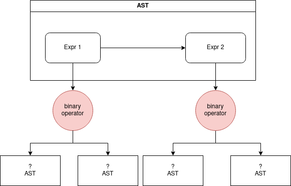

# What The Shell

A simple shell written in Rust using a tree walk interpreter for the shell language.

## Installation Instructions

```bash
cargo build --release 
chmod +x /path/to/bin/what-the-shell
/path/to/bin/what-the-shell
```

## Interpreter Processes

### Tokenizing

First, we have our lexer/scanner which will read in a string and output an array (in the case vector) of tokens. These tokens are structs that contain information about the token and is implemented as below. The scanner is implemented by `scanner.rs` file and tokens are implemented by `token.rs`.

```rust
pub struct Token {
    pub t_type: TokenType,
    pub literal: WTSType,
    pub lexeme: String,
    pub line: usize,
}
```

#### Example

```bash
ls -la | base64
```
If we have run the command above, the scanner will output the struct below:

```rust
Scanner {
    source: "ls -la | base64\n",
    tokens: [
        Token {
            t_type: Word,
            literal: NONE,
            lexeme: "ls",
            line: 1,
        },
        Token {
            t_type: ShortFlag,
            literal: NONE,
            lexeme: "-",
            line: 1,
        },
        Token {
            t_type: Word,
            literal: NONE,
            lexeme: "la",
            line: 1,
        },
        Token {
            t_type: Pipe,
            literal: NONE,
            lexeme: "|",
            line: 1,
        },
        Token {
            t_type: Word,
            literal: NONE,
            lexeme: "base64",
            line: 1,
        },
        Token {
            t_type: EOF,
            literal: NONE,
            lexeme: "",
            line: 2,
        },
    ],
    start: 15,
    current: 16,
    line: 2,
}
```


### Grammar

The grammar below covers what types of statements are allowed by the language. This is not one-to-one as there are some features that need to be implemented. For example binary expressions cannot be chained without using parenthesis to isolate each binary expression:
#### Invalid
`echo "AAAAAAAA" | base64 > out.txt`
#### Valid
`(echo "AAAAAAAAA" | base64) > out.txt`
```
    expression      → "(" expression ")"
                    | expression binary_operator expression
                    | expression unary_operator
                    | command;

    command         → WORD arguments;

    arguments       → WORD*
                    | flag*  arguments;

    flag            → SHORT_FLAG
                    | LONG_FLAG;

    SHORT_FLAG      → "-" FLAG_NAME;
    LONG_FLAG       → "--" FLAG_NAME;

    FLAG_NAME       → WORD;

    STRING          → /".*"/;
    WORD            → /[A-Za-z0-9_-_.]+/;

    unary_operator  → ";";
    
    binary_operator → "|"
                    | ">";
                    | ">>";
                    | "<";
                    | "<<";
```

### Parsing

After tokenizing and getting a vector of tokens, we take these tokens and create an abstract syntax tree for our tree-walk-interpret to walk through. This is done by taking the tokens and applying them through our pre-defined grammar. To construct the AST I used a tree like format where each level of the tree has an array of expressions whose left and right nodes are additional AST structs. In `ast.rs` the struct is implemented:

```rust
#[derive(Debug)]
pub struct AST{
    pub exprs: Vec<Expr>
}


#[derive(Debug)]
pub struct Expr{
    pub kind: Kind,
    pub flags: Vec<String>,
    pub args: Vec<String>,
    pub symbol: Symbol,
    pub value: Option<String>,
    pub left: Option<AST>,
    pub right: Option<AST>,
}
```

`AST` is just a vector of `Expr`, this documentation will cover how this is traversed later. For now here is a simple diagram of it



```bash
ls -la | base64
```

So if we run the command above, we will get the following AST output below.


```rust
AST {
    exprs: [
        Expr {
            kind: Expr,
            flags: [],
            args: [],
            symbol: Pipe,
            value: Some(
                "|",
            ),
            left: Some(
                AST {
                    exprs: [
                        Expr {
                            kind: Value,
                            flags: [
                                "-la",
                            ],
                            args: [],
                            symbol: Cmd,
                            value: Some(
                                "ls",
                            ),
                            left: None,
                            right: None,
                        },
                    ],
                },
            ),
            right: Some(
                AST {
                    exprs: [
                        Expr {
                            kind: Value,
                            flags: [],
                            args: [],
                            symbol: Cmd,
                            value: Some(
                                "base64",
                            ),
                            left: None,
                            right: None,
                        },
                    ],
                },
            ),
        },
    ],
}
```

### Interpreter

With the AST generated, the tree walk interpreter will traverse the AST by iterating through all the expressions and interpreting them by evaluating each expression from left to right. Unary expressions are immediately evaluated while binary expressions may evaluate the right side first based on the operator. Most binary operators were piping the stdout of one side to the commands on the other. In all cases this was storing the bytes in memory and passing it to the next processes once the side was completely interpreted. This implementation is done through the `interpreter.rs` file.

## Special Commands

Specials commands such as `exit` and `cd` are implemented directly and will work *weirdly*. `exit` works normally however `cd` will go to the chosen directory and set the current execution context of commands. However certain part of `cd` require implementation such as `cd -` or other features since they require a lot more code.
